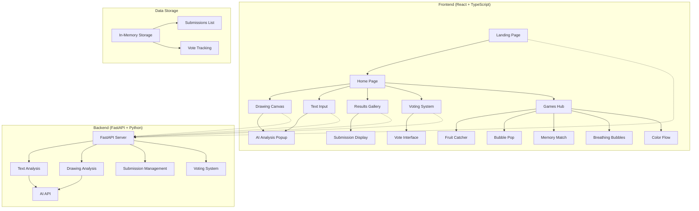
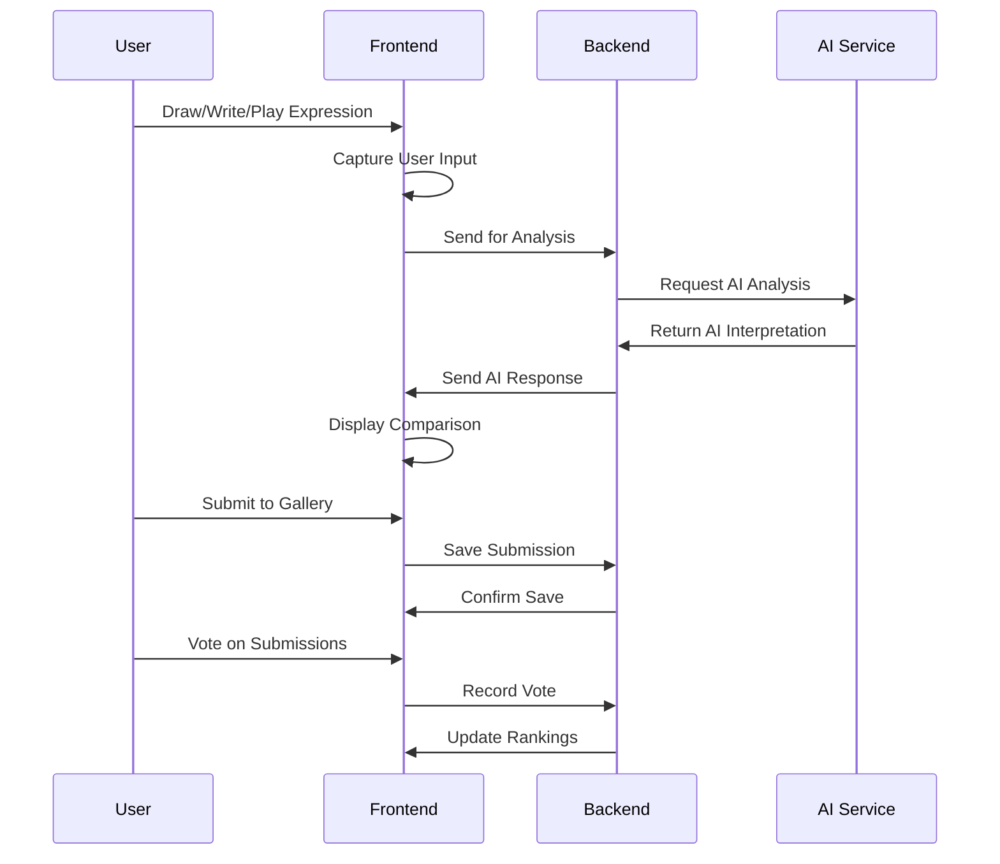

# Mood Trace 🎭

> **Where human emotions meet AI interpretation**  
> An interactive web application that showcases the beautiful contrast between human emotional expression and AI's detached, algorithmic interpretation through drawing, text, and therapeutic games.

[](https://reactjs.org/)
[](https://www.typescriptlang.org/)
[](https://fastapi.tiangolo.com/)
[](https://tailwindcss.com/)
[](LICENSE)

## Overview

**Mood Trace** is an interactive web app where you get to express how you feel—through drawing, therapeutic games, or writing—and then watch as AI tries to make sense of it. The idea is to explore how humans communicate emotion in rich, subtle ways… and how AI, no matter how advanced, often misinterprets or oversimplifies those feelings. It's a reflection on the gap between real emotion and machine understanding, with added stress relief through therapeutic gaming.

## Key Features

- **Drawing Challenge**: Draw your emotions freely and see how AI sanitizes them
- **Text Challenge**: Write honestly about your feelings and watch AI transform them into corporate speak
- **Therapeutic Games Hub**: Stress relief games including Fruit Catcher, Bubble Pop, Memory Match, and more
- **Community Voting**: Vote on which expressions feel more authentic and human
- **Gallery & Rankings**: View top submissions and see how humans consistently win
- **AI Analysis**: Real-time AI interpretation with deployed backend integration

## Architecture



## Workflow



## Features

### Drawing Challenge

- **Free-form drawing canvas**
- **Mood-based prompts**
- **Real-time AI analysis**
- **Side-by-side comparison**

### Text Challenge

- **Rich text input**
- **AI tone analysis**
- **Metaphor detection**
- **Emotional depth analysis**

### Therapeutic Games Hub

- **Fruit Catcher Deluxe**: Relaxing arcade game for stress relief
- **Bubble Pop Therapy**: Therapeutic bubble popping with satisfying effects
- **Memory Match Zen**: Brain training with beautiful memory cards
- **Color Flow Meditation**: Meditative color pattern flow
- **Breathing Bubbles**: Guided breathing exercises with visual feedback

### Community Features

- **Vote on submissions**
- **Gallery rankings**
- **Statistics dashboard**
- **Real-time updates**

### Gallery & Rankings

- **Hall of Fame** for top submissions
- **Time-based sorting**
- **Category filtering**
- **Detailed statistics**

## Technology Stack

### Frontend

- **React 18** - Modern UI framework
- **TypeScript** - Type-safe development
- **Tailwind CSS** - Utility-first styling
- **Lucide React** - Beautiful icons
- **Vite** - Fast build tool
- **Canvas API** - Drawing functionality

### Backend

- **FastAPI** - Modern Python web framework
- **Pydantic** - Data validation
- **Uvicorn** - ASGI server
- **AI API Integration** - Ready for OpenAI/GROQ integration

### Development Tools

- **ESLint** - Code linting
- **PostCSS** - CSS processing
- **TypeScript** - Type checking

## Installation & Setup

### Prerequisites

- Node.js (v18 or higher)
- Python (v3.8 or higher)
- npm or yarn

### Frontend Setup

```bash
# Clone the repository
git clone https://github.com/Samritakhurana/Human-vs-ai.git
cd Human-vs-ai

# Install dependencies
npm install

# Start development server
npm run dev
```

### Backend Setup

```bash
# Navigate to backend directory
cd backend

# Create virtual environment
python -m venv venv

# Activate virtual environment
# On Windows:
venv\Scripts\activate
# On macOS/Linux:
source venv/bin/activate

# Install dependencies
pip install fastapi uvicorn pydantic

# Start backend server
uvicorn main:app --reload --port 8000
```

### Environment Variables

Create a `.env` file in the backend directory:

```env
AI_API_KEY=your_ai_api_key_here
```

## Usage

### Getting Started

1. **Visit the landing page** and click "Start Tracing Moods"
2. **Choose your challenge**: Drawing, Text, or Games
3. **Express yourself** freely and authentically
4. **Watch AI analyze** your expression
5. **Compare the results** and see the difference
6. **Submit to gallery** for community voting
7. **Vote on others' submissions** and see rankings

### Drawing Challenge

- Use the canvas to draw your emotions
- Try mood-based prompts for inspiration
- Click "Analyze with AI" to see interpretation
- Submit your creation to the gallery

### Text Challenge

- Write about your feelings, experiences, or thoughts
- Be honest and authentic in your expression
- See how AI "improves" your writing
- Compare the emotional depth

### Games Hub

- Access therapeutic stress relief games
- Choose from various game categories
- Track your relaxation progress
- Enjoy immersive gaming experiences

## Project Structure

```
Human-vs-ai/
├── src/
│   ├── components/
│   │   ├── LandingPage.tsx      # Initial landing experience
│   │   ├── HomePage.tsx         # Main navigation hub
│   │   ├── DrawingCanvas.tsx    # Drawing interface
│   │   ├── TextInput.tsx        # Text input interface
│   │   ├── VotingSystem.tsx     # Voting interface
│   │   ├── ResultsGallery.tsx   # Gallery and rankings
│   │   ├── Header.tsx           # Global navigation
│   │   ├── Footer.tsx           # Site footer
│   │   ├── AIResponsePopup.tsx  # AI analysis display
│   │   └── hooks/
│   │       └── useCanvas.ts     # Canvas drawing logic
│   ├── games/
│   │   ├── FruitCatcher.tsx     # Fruit catching game
│   │   ├── BubblePop.tsx        # Bubble popping game
│   │   ├── MemoryMatch.tsx      # Memory matching game
│   │   ├── BreathingBubbles.tsx # Breathing exercise game
│   │   └── ColorFlow.tsx        # Color flow meditation
│   ├── GamesHub.tsx             # Games hub interface
│   ├── services/
│   │   └── api.ts               # API service functions
│   ├── lib/
│   │   └── tfModel.ts           # TensorFlow integration
│   ├── App.tsx                  # Main application
│   └── main.tsx                 # Entry point
├── backend/
│   ├── main.py                  # FastAPI server
│   ├── requirements.txt         # Python dependencies
│   └── env.example              # Environment variables example
├── public/                      # Static assets
└── package.json                 # Dependencies
```

## API Endpoints

### Text Analysis

```http
POST /analyze-text
Content-Type: application/json

{
  "user_text": "Your emotional expression here"
}
```

### Drawing Analysis

```http
POST /analyze-drawing
Content-Type: application/json

{
  "drawing_data": "base64_encoded_image_data"
}
```

### Submissions

```http
GET /submissions          # Get all submissions
POST /submissions         # Save new submission
POST /submissions/{id}/vote  # Vote on submission
```

## Deployment

### Frontend Deployment

```bash
# Build for production
npm run build

# Deploy to your preferred platform
# (Vercel, Netlify, GitHub Pages, etc.)
```

### Backend Deployment

The backend is deployed on Replit and accessible at:

```
https://079dd24c-76f9-429b-92dd-303ffc5c4e1a-00-13hi5gd0yb1m2.sisko.replit.dev/
```

## 📈 Roadmap

### Phase 1 (Current)

- ✅ Basic drawing and text challenges
- ✅ AI analysis integration
- ✅ Community voting system
- ✅ Gallery and rankings
- ✅ Interactive therapeutic games
- ✅ Deployed backend integration

### Phase 2 (Planned)

- Advanced AI models integration
- Real-time collaboration features
- Mobile app development
- Social media sharing
- Advanced game analytics

### Phase 3 (Future)

- Machine learning model training
- Advanced analytics dashboard
- API for third-party integrations
- Multi-language support
- VR/AR gaming experiences

## Troubleshooting

**Frontend not loading:**

```bash
# Clear cache and reinstall
rm -rf node_modules package-lock.json
npm install
```

**Backend connection error:**

```bash
# Check if server is running
curl https://079dd24c-76f9-429b-92dd-303ffc5c4e1a-00-13hi5gd0yb1m2.sisko.replit.dev/

# Check logs
uvicorn main:app --reload --log-level debug
```

**Drawing canvas issues:**

- Ensure browser supports Canvas API
- Check for JavaScript errors in console
- Verify touch events on mobile devices

## License

This project is licensed under the MIT License - see the [LICENSE](LICENSE) file for details.

## Acknowledgments

- **CS Girlies Hackathon** for the inspiration
- **OpenAI/GROQ** for AI analysis capabilities
- **React and FastAPI** communities for excellent documentation
- **All contributors** who help make this project better

## 📞 Contact

- **Project Link**: [https://github.com/Samritakhurana/Human-vs-ai](https://github.com/Samritakhurana/Human-vs-ai)
- **Backend URL**: [https://079dd24c-76f9-429b-92dd-303ffc5c4e1a-00-13hi5gd0yb1m2.sisko.replit.dev/](https://079dd24c-76f9-429b-92dd-303ffc5c4e1a-00-13hi5gd0yb1m2.sisko.replit.dev/)

---

**Made with ❤️ by humans, for humans**  
_(AI helped with the boring parts)_
