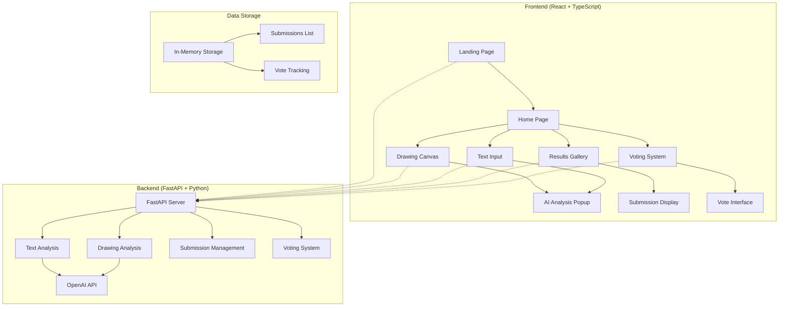
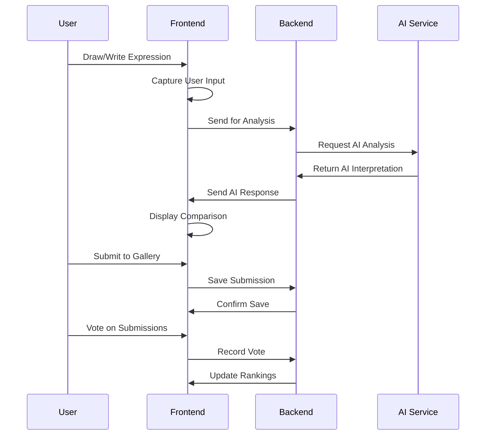

# Human vs AI 🎭

> **Can machines feel what we feel?**  
> A web application that showcases the beautiful contrast between human emotional expression and AI's detached, algorithmic interpretation.

[](https://reactjs.org/)
[](https://www.typescriptlang.org/)
[](https://fastapi.tiangolo.com/)
[](https://tailwindcss.com/)
[](LICENSE)

## Overview

**Human vs AI** is an interactive web application that explores the fundamental differences between human emotional expression and artificial intelligence's interpretation. Users can draw or write their feelings, then watch as AI attempts to "improve" or analyze their authentic expressions, often missing the subtle nuances that make us human.

## Key Features

-  **Drawing Challenge**: Draw your emotions freely and see how AI sanitizes them
-  **Text Challenge**: Write honestly about your feelings and watch AI transform them into corporate speak
-  **Community Voting**: Vote on which expressions feel more authentic and human
-  **Gallery & Rankings**: View top submissions and see how humans consistently win
-  **AI Analysis**: Real-time AI interpretation (with API key integration ready)

## Architecture



## Workflow



## Features

### Drawing Challenge

- **Free-form drawing canvas** with intuitive tools
- **Mood-based prompts** to inspire emotional expression
- **Real-time AI analysis** of your artistic expression
- **Side-by-side comparison** of human vs AI interpretation

### Text Challenge

- **Rich text input** for stories, poems, or feelings
- **AI tone analysis** and "improvement" suggestions
- **Metaphor detection** and clinical reinterpretation
- **Emotional depth analysis** vs AI's sanitized version

### Community Features

- **Vote on submissions** to determine which feels more human
- **Gallery rankings** with top human expressions
- **Statistics dashboard** showing human vs AI preferences
- **Real-time updates** of community votes

### Gallery & Rankings

- **Hall of Fame** for top submissions
- **Time-based sorting** and trending
- **Category filtering** (drawing vs text)
- **Detailed statistics** and analytics

## Technology Stack

### Frontend

- **React 18** - Modern UI framework
- **TypeScript** - Type-safe development
- **Tailwind CSS** - Utility-first styling
- **Lucide React** - Beautiful icons
- **Vite** - Fast build tool
- **Canvas API** - Drawing functionality

### Backend

- **FastAPI** - Modern Python web framework
- **Pydantic** - Data validation
- **Uvicorn** - ASGI server
- **GROQ API** - AI analysis (ready for integration)

### Development Tools

- **ESLint** - Code linting
- **PostCSS** - CSS processing
- **TypeScript** - Type checking

## Installation & Setup

### Prerequisites

- Node.js (v18 or higher)
- Python (v3.8 or higher)
- npm or yarn

### Frontend Setup

```bash
# Clone the repository
git clone https://github.com/yourusername/human-vs-ai.git
cd human-vs-ai

# Install dependencies
npm install

# Start development server
npm run dev
```

### Backend Setup

```bash
# Navigate to backend directory
cd backend

# Create virtual environment
python -m venv venv

# Activate virtual environment
# On Windows:
venv\Scripts\activate
# On macOS/Linux:
source venv/bin/activate

# Install dependencies
pip install fastapi uvicorn pydantic

# Start backend server
uvicorn main:app --reload --port 8000
```

### Environment Variables

Create a `.env` file in the backend directory:

```env
GROQ_API_KEY=your_GROQ_api_key_here
```
### Getting Started

1. **Visit the landing page** and click "Try Human vs AI"
2. **Choose your challenge**: Drawing or Text
3. **Express yourself** freely and authentically
4. **Watch AI analyze** your expression
5. **Compare the results** and see the difference
6. **Submit to gallery** for community voting
7. **Vote on others' submissions** and see rankings

### Drawing Challenge

- Use the canvas to draw your emotions
- Try mood-based prompts for inspiration
- Click "Analyze with AI" to see interpretation
- Submit your creation to the gallery

### Text Challenge

- Write about your feelings, experiences, or thoughts
- Be honest and authentic in your expression
- See how AI "improves" your writing
- Compare the emotional depth

## Project Structure

```
human-vs-ai/
├── src/
│   ├── components/
│   │   ├── LandingPage.tsx      # Initial landing experience
│   │   ├── HomePage.tsx         # Main navigation hub
│   │   ├── DrawingCanvas.tsx    # Drawing interface
│   │   ├── TextInput.tsx        # Text input interface
│   │   ├── ResultsGallery.tsx   # Gallery and rankings
│   │   ├── Header.tsx           # Global navigation
│   │   ├── Footer.tsx           # Site footer
│   │   └── AIResponsePopup.tsx  # AI analysis display
│   ├── hooks/
│   │   └── useCanvas.ts         # Canvas drawing logic
│   ├── lib/
│   │   └── tfModel.ts           # TensorFlow integration
│   ├── App.tsx                  # Main application
│   └── main.tsx                 # Entry point
├── backend/
│   └── main.py                  # FastAPI server
├── public/                      # Static assets
└── package.json                 # Dependencies
```

### Text Analysis

```http
POST /analyze-text
Content-Type: application/json

{
  "user_text": "Your emotional expression here"
}
```

### Drawing Analysis

```http
POST /analyze-drawing
Content-Type: application/json

{
  "drawing_data": "base64_encoded_image_data"
}
```

### Submissions

```http
GET /submissions          # Get all submissions
POST /submissions         # Save new submission
POST /submissions/{id}/vote  # Vote on submission
```

### Frontend Deployment

```bash
# Build for production
npm run build

# Deploy to your preferred platform
# (Vercel, Netlify, GitHub Pages, etc.)
```

### Backend Deployment

```bash
# Install production dependencies
pip install -r requirements.txt

# Start production server
uvicorn main:app --host 0.0.0.0 --port 8000
```

## 📈 Roadmap

### Phase 1 (Current)

- Basic drawing and text challenges
- AI analysis integration
- Community voting system
- Gallery and rankings
- Interactive Games

### Phase 2 (Planned)

- Advanced AI models integration
- Real-time collaboration features
- Mobile app development
- Social media sharing

### Phase 3 (Future)

- Machine learning model training
- Advanced analytics dashboard
- API for third-party integrations
- Multi-language support

**Frontend not loading:**

```bash
# Clear cache and reinstall
rm -rf node_modules package-lock.json
npm install
```

**Backend connection error:**

```bash
# Check if server is running
curl http://localhost:8000/

# Check logs
uvicorn main:app --reload --log-level debug
```

## License

This project is licensed under the MIT License - see the [LICENSE](LICENSE) file for details.

## Acknowledgments

- **CS Girlies Hackathon** for the inspiration
- **GroqAPI** for AI analysis capabilities
- **React and FastAPI** communities for excellent documentation
- **All contributors** who help make this project better


